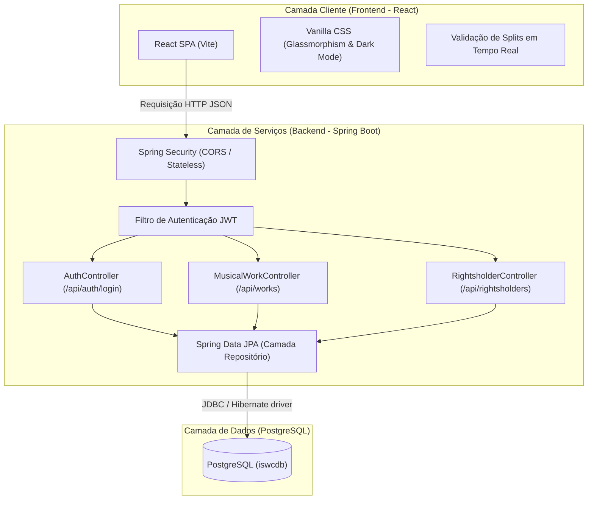
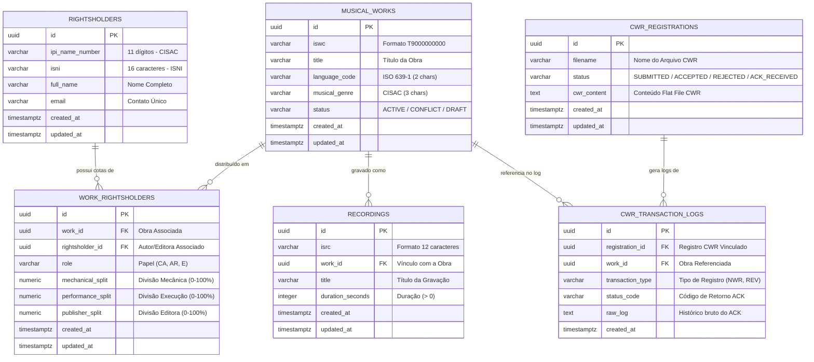

# Plataforma Global de Gestão de Direitos Autorais (ISWC & CWR)

Plataforma integrada de catalogação musical, divisões de cotas de direitos autorais (*split sheets*) e compliance com o ecossistema CISAC (CWR/ISWC). Este repositório adota uma arquitetura monorepo desacoplada com **Java / Spring Boot** no Backend e **JavaScript / React (Vite)** no Frontend, conectado a uma base de dados relacional **PostgreSQL**.

---

## 🏗️ Arquitetura de Software

O ecossistema é projetado de forma desacoplada com uma API REST Stateless protegida por tokens JWT e um cliente SPA altamente interativo.



---

## 🗄️ Modelagem e Esquema do Banco de Dados (ERD)

O banco de dados relacional foi modelado de forma a garantir a integridade referencial dos metadados de domínio (ISWC, ISRC, IPI, ISNI) exigidos pelas sociedades arrecadadoras de direitos (como o ECAD e a CISAC).



---

## 🛠️ Configuração e Execução do Repositório

### Requisitos Prévios
- **Java JDK 23** ou superior
- **Apache Maven 3.9** ou superior
- **Node.js v23** e **npm 11** ou superior
- Instância do **PostgreSQL** rodando no endereço configurado (`192.168.1.107:5432` / Banco `iswcdb`)

---

### Executando o Backend (Java Spring Boot)

1. Entre no diretório do backend:
   ```bash
   cd backend
   ```
2. Inicie a aplicação com o Maven plugin:
   ```bash
   mvn spring-boot:run
   ```
   *A API estará ativa em `http://localhost:8080/api`*

---

### Executando o Frontend (React / Vite)

1. Entre no diretório do frontend:
   ```bash
   cd frontend
   ```
2. Instale as dependências caso ainda não tenha feito:
   ```bash
   npm install
   ```
3. Inicie o servidor de desenvolvimento:
   ```bash
   npm run dev
   ```
   *O dashboard web estará acessível em `http://localhost:5173`*

---

## 🛡️ Credenciais de Acesso (Login Administrativo)
Para inserir ou modificar obras e splits no dashboard, faça login com as credenciais padrão de desenvolvimento:
* **Usuário:** `admin`
* **Senha:** `nso1810`
